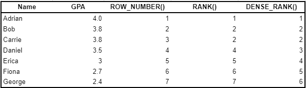

#### Rank vs Dense Rank vs Row Number
It’s a very common application to rank rows and values. Here’s a few examples where companies frequently use ranking:

- Ranking highest valued customers by number of purchases, profits, etc.
- Ranking the top products sold by number of units sold
- Ranking the top countries with the most sales
- Ranking the top videos viewed by number of minutes watched, number of distinct viewers, etc.

In SQL, there’s several ways that you can assign a “rank” to a row, which we’ll dive into with an example. Consider the follow query and results:

```
SELECT Name
       , GPA
       , ROW_NUMBER() OVER (ORDER BY GPA desc)
       , RANK() OVER (ORDER BY GPA desc)
       , DENSE_RANK() OVER (ORDER BY GPA desc)
FROM student_grades
```



**ROW_NUMBER()** returns a unique number for each row starting at 1. When there are ties (eg. Bob vs Carrie), ROW_NUMBER() arbitrarily assigns a number if a second criteria is not defined.

**RANK()** returns a unique number for each row starting at 1, except for when there are ties, then RANK() will assign the same number. As well, a gap will follow a duplicate rank.

**DENSE_RANK()** is similar to RANK() except that there are no gaps after a duplicate rank. Notice that with DENSE_RANK(), Daniel’s ranked 3rd as opposed to 4th with RANK().

